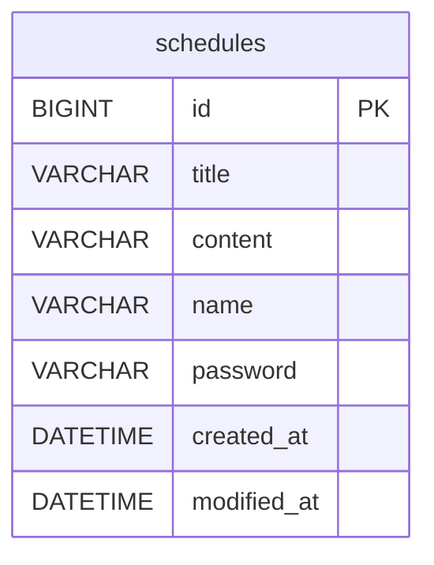

#  일정 관리 앱 (Spring Schedule)

---

## 1. 프로젝트 소개
- 일정(Schedule) CRUD 구현
- 댓글(Comment) 작성
- 일정 단건 조회 시 댓글 포함 응답
- 입력값 검증
- Spring Boot + Spring Data JPA + MySQL 기반

---

## 2. 기술 스택
- Java 17
- Spring Boot
- Spring Web
- Spring Data JPA
- MySQL Driver
- Lombok
- Gradle

---
## 3. 패키지 구조
- `spartaclub.planit.api`
  - `controller`
  - `dto`
  - `entity`
  - `repository`
  - `service`
---

## 4. ERD



## 5. API 명세

### 5.1 공통 정보
- Base URL: `http://localhost:8080`
- Content-Type: `application/json`
- 모든 응답에서 `password`는 포함하지 않는다.

### 5.2 공통 상태 코드

| 상태코드 | 이름         | 의미                         | 언제 발생하는가 |
|---------:|--------------|------------------------------|-----------|
| 200      | OK           | 요청 성공                    | 조회/수정 성공 |
| 201      | Created      | 생성 성공                    | 일정/댓글 생성 성공 |
| 204      | No Content   | 삭제 성공                    | 일정 삭제 성공 |
| 400      | Bad Request  | 잘못된 요청                  | 입력값 검증 실패, 비밀번호 불일치, 댓글 10개 초과 등 |
| 404      | Not Found    | 리소스 없음                  | 존재하지 않는 일정 조회/수정/삭제 시 |


### 5.3 공통 에러 응답

**400 Bad Request**
- `message`: "에러 메시지"

```json
{
  "message": "없음"
}
```

---

## 6. Schedule API

### 6.1 일정 생성
- `POST /schedules`

**상태 코드**
| 상태코드 | 의미 |
|---------:|------|
| 201      | 일정 생성 성공 |
| 400      | 입력값 검증 실패 |

**Request Body**
```json
{
  "title": "일정1",
  "content": "내용1",
  "name": "문",
  "password": "2222"
}
```

**Response (201 Created)**
```json
{
  "id": 1,
  "title": "일정1",
  "content": "내용1",
  "name": "문",
  "createdAt": "~",
  "modifiedAt": "~"
}
```

---

### 6.2 전체 일정 조회
- `GET /schedules`
- Query Param: `name`
- 정렬: `modifiedAt` 내림차순으로 갑니다

**상태 코드**
| 상태코드 | 의미 |
|---------:|------|
| 200      | 조회 성공 |

**예시 호출**
- `/schedules`
- `/schedules?name=문`

**Response (200 OK)**
```json
[
  {
    "id": 2,
    "title": "일정2",
    "content": "내용2",
    "name": "문",
    "createdAt": "~",
    "modifiedAt": "~"
  },
  {
    "id": 1,
    "title": "일정1",
    "content": "내용1",
    "name": "문",
    "createdAt": "~",
    "modifiedAt": "~"
  }
]
```

---

### 6.3 선택 일정 단건 조회
- `GET /schedules/{scheduleId}`

**상태 코드**
| 상태코드 | 의미 |
|---------:|------|
| 200      | 조회 성공 |
| 404      | 일정이 없음 |

**Response (200 OK)**
```json
{
  "id": 1,
  "title": "일정1",
  "content": "내용1",
  "name": "문",
  "createdAt": "~",
  "modifiedAt": "~",
}
```
---

### 6.4 선택 일정 수정 (비밀번호가 필요힙니다)
- `PATCH /schedules/{scheduleId}`
- 수정 가능: `title`, `name`만 수정 가능
- 수정 완료 시 `modifiedAt`을 갱신함

**상태 코드**
| 상태코드 | 의미 |
|---------:|------|
| 200      | 수정 성공 |
| 400      | 비밀번호 불일치/입력값 검증 실패 |
| 404      | 일정이 없음 |

**Request Body**
```json
{
  "title": "일정1 수정",
  "name": "문혜린",
  "password": "2222"
}
```

**Response (200 OK)**
```json
{
  "id": 1
  "title": "일정1 수정",
  "content": "내용1",
  "name": "문혜린",
  "createdAt": "~",
  "modifiedAt": "~"
}
```

---

### 6.5 선택 일정 삭제 (비밀번호가 필요합니다)
- `DELETE /schedules/{scheduleId}`

**상태 코드**
| 상태코드 | 의미 |
|---------:|------|
| 204      | 삭제 성공 |
| 400      | 비밀번호 불일치 |
| 404      | 일정이 없음 |

**Request Body**
```json
{
  "password": "2222"
}
```

**Response (204 No Content)**

---

## 7. 입력 검증 규칙

### Schedule
- `title`: 필수, 최대 30자
- `content`: 필수, 최대 200자
- `authorName`: 필수
- `password`: 필수

---
